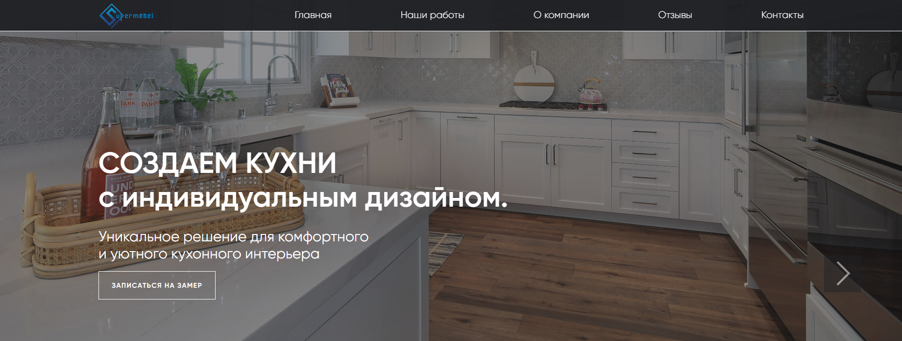

# Проект: адаптивный интернет магазин SUPERMEBEL.

### [ Ссылка на проект ](https://supermebel30.ru/)

### Цель и задачи проекта:

<div>
<p>Реализовано веб-приложение (сайт), содержащее следующие страницы:</p>
<ul>
<li>Главная страница со списком товаров (карточек), содержащих изображение, заголовок, описание.</li>
<li>Страница товара – содержащая фотографию, название и описание товара, а также содержащая кнопку действия.</li>
<li>Модальное окно обратной связи с подключенным телеграмм-ботом.</li>
</ul>
</div>


<br />

This is a [Next.js](https://nextjs.org/) project bootstrapped with [`create-next-app`](https://github.com/vercel/next.js/tree/canary/packages/create-next-app).

## Getting Started

Запуск в режиме разработки:

```bash
npm run dev
```

Запуск сборки для хостинга:

```bash
npm run build-export
```
### Данный проект создавался на стеке:


<br />

### Используемые программы:


